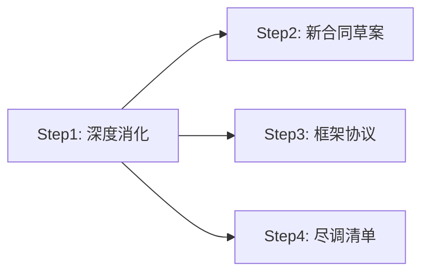

# Qiaoxi Contract-Analyzer 开发进度报告

> **报告生成时间**：2026年6月8日  
> **项目状态**：Phase 1-3 开发完成，进入调试与打磨阶段  
> **项目根目录**：`d:\Ai RAG\Qiaoxi`  
> **框架**：Python + Streamlit（前后端一体）  
> **AI 模型**：DeepSeek API（`deepseek-chat`），通过 OpenAI 兼容客户端调用  

---

## 一、项目整体架构

### 1.1 核心理念

Qiaoxi（乔曦）是霖信莯咨询为商业咨询顾问打造的 AI 驱动商业合同审查与决策重构系统。从商业咨询顾问视角出发，输出《商业决策报告》——直接告诉客户"能不能签、怎么改、谈不拢怎么退"。区别于传统法律角度的合同审查工具。

### 1.2 方法论：商业咨询五步法

```
客户画像与利益校准 → 商业模式系统动力学解构 → 核心风险识别（法律+商业+人性） → 后果推演与不对称性评估 → 杠杆解重构
```

### 1.3 数字团队架构

- **乔曦**（法务助理 + 系统主控）：State 2 法律初审（强制 RAG），报告组装
- **六位评审员**（6 个独立 Agent）：State 4 并行独立审查，记忆隔离，一票否决权
- **李超逸**（AI 决策者）：State 6 四选一决策（签/改/拖/退）

### 1.4 管线设计：Pipeline 9-State 状态机

```
State 0:  画像校准 → client_profile.json（零开放输入，封闭式点选）
State 1:  合同解析 → clause_tree.json（正则切分 + 条款树）
State 2:  乔曦初审 → jo_legal_review.json（强制触发本地法规 RAG）
State 3:  商业模式提取 → cld_report.md（资金流向+权力分配+时间轴）
State 4:  六位评审员并行审计 → audits（6 实例记忆隔离）
State 5:  推演引擎 + 辩论 → simulation_snapshot.json（确定性推演 + LLM 合成）
State 6:  李超逸决策 → decision_order.json（L1+L2+L3 三层蒸馏包）
State 7:  标准版报告 → final_report.md（8 章结构）
State 8:  合同重构 → 新合同草案 + 框架协议 + 尽调清单
```

---

## 二、文件组织

### 2.1 核心源码（`src/`）

| 文件 | 对应 State | 职责 |
|------|-----------|------|
| `config.py` | — | 全局常量：API Key、模型名、RAG 参数、评审员顺序、推演切片 |
| `fsm.py` | 全部 | 有限状态机核心，定义九大状态及其合法转换规则 |
| `security.py` | — | PII 脱敏引擎、AES-256 加密层、AuditLogger（WORM 审计日志）、用户授权协议模板 |
| `rag_loader.py` | — | 法规数据库清洗脚本（Chinese-Dataset-Laws + lawtext-laws），条款级切分，JSON 导出 |
| `rag_retriever.py` | — | 本地关键词 RAG（关键词→法条映射 + 模糊匹配），纯本地，不依赖 ChromaDB |
| `state0_profile.py` | State 0 | 客户画像问题定义（Q1-Q6 封闭式点选）及 `build_client_profile()` |
| `state1_parse.py` | State 1 | 合同文件解析器，三级降级解析（python-docx→pdfplumber→PyMuPDF），条款树提取 |
| `state2_legal_review.py` | State 2 | 乔曦法律初审引擎，代入客户画像逐条分析，强制 RAG 注入 |
| `state3_cld.py` | State 3 | 商业模式解构引擎，CLD 因果回路图生成 |
| `state4_council.py` | State 4 | 六位评审员串行审计引擎，含 6 份独立 System Prompt + JSON Schema 校验 + 重试+降级 |
| `state5_simulation.py` | State 5 | 确定性推演引擎（纯 Python）+ DebateSynthesizer（LLM 辩论合成） |
| `state6_decision.py` | State 6 | 李超逸决策引擎，L1 六戒律硬编码 + L2 人格核注入 + L3 并购规则注入 |
| `state8_reconstruct.py` | State 8 | 合同重构引擎，四步串行（消化→合同→框架→尽调） |

### 2.2 主入口

| 文件 | 说明 |
|------|------|
| `app.py` | Streamlit 单文件应用，9 个 Phase 状态机，~1559 行 |
| `CLAUDE.md` | 项目文档（给 AI 助手读的） |

### 2.3 数据

| 路径 | 内容 |
|------|------|
| `data/laws_clean/cleaned_laws.json` | 清洗后的中国法律法规（~55,088 条/1,132 部法，24.5MB） |
| `audit.log` | WORM 审计日志文件 |

### 2.4 测试与案例

| 路径 | 内容 |
|------|------|
| `test documents/` | 3 份测试合同（保密协议/咨询顾问合同/股东合作协议） |
| `test documents/案例：煤矿并购合同/` | 煤矿并购案例（原始合同 + 审查意见 + 框架协议 + 尽调清单） |

---

## 三、Phase 1：基础设施（已完成）

### 3.1 项目框架搭建

Streamlit 单文件架构，`app.py` 作为唯一前端入口，以 `st.session_state.phase` 作为简易状态机驱动页面流转：

```
payment → consent → upload → profile_r1 → profile_r2 → processing → results → reconstructing → reconstruct_done
```

**Session State DEFAULTS 模式**：所有持久化 key 定义在 DEFAULTS 字典中，循环 `if k not in st.session_state` 初始化。防止因页面刷新或热重载导致 key 丢失报错。DEFAULTS 包含约 20 个 key，覆盖上传文件、合同摘要、画像、审查结果、报告、重构输出等全部中间态。

### 3.2 合同解析管线（State 1）

**文件**：`src/state1_parse.py` · `QiaoxiContractParser` 类

#### 文档解析三级降级策略

```
DOCX → python-docx 直接提取（精度最高，无编码问题）
PDF → pdfplumber（x_tolerance=3, y_tolerance=3，处理 Identity-H 中文字体）
PDF → PyMuPDF / fitz 兜底
```

**为什么需要三级降级**：中文 PDF 常常使用 Identity-H 编码的中文字体，PyMuPDF 直接提取会乱码（标记为 Identity-H 字体），pdfplumber 在处理这类字体时表现更优。DOCX 是最优选择。

#### 条款树提取 `_extract_clause_tree()`

**方法**：正则匹配 `第[一二三四五六七八九十百千\d]+条` 作为条款分割标记。提取的条款按顺序编号为 `CLS-0001`、`CLS-0002`……等内部 ID。每条条款包含 `heading` 和 `content` 两个字段。

**局限性**：纯正则切分，不能处理嵌套条款结构，不能识别"附则""附件"等非标准格式，准确度依赖原合同格式规范性。

### 3.3 法规 RAG 引擎

**文件**：`src/rag_retriever.py` · `search_relevant_laws()`

**技术方案**：纯本地关键词匹配，不依赖向量数据库/Embedding 模型。

**工作原理**：
1. 关键词库：建立约 30 个关键词→法条映射（如 "违约"→["民法典 合同编 违约责任", "民法典 第577条"]）
2. 从合同文本中提取关键词，匹配法条
3. 如果关键词未命中，用核心法律名称（民法典、公司法等）做模糊匹配
4. 结果按 `relevance` 排序，取 top_k

**数据规模**：`cleaned_laws.json` 包含约 55,088 条法律条款（按"第X条"切分），覆盖 1,132 部法律。加载时全量放入内存缓存（`_laws_cache` 全局变量）。

**为什么不用 ChromaDB**：MVP 阶段优先简化依赖，bge-m3 Embedding（~2GB 内存）+ ChromaDB 的管线已在 `rag_loader.py` 中预留，Phase 1.5 实现。当前纯关键词方案足够过滤明显无关法条。

### 3.4 脱敏引擎（Security）

**文件**：`src/security.py`

核心安全机制是 AI 模型在整个分析过程中只能接触脱敏后的文本。

#### PII 脱敏规则

| 信息类型 | 脱敏方式 | 正则/规则 |
|----------|---------|-----------|
| 身份证号 | `440301********1234` | `\d{17}[\dXx]` |
| 手机号 | `138****5678` | `1[3-9]\d{9}` |
| 银行卡号 | `6222 **** **** 7890` | 正则匹配后前4后4 |
| 统一社会信用代码 | `[已脱敏-统一社会信用代码]` | 格式正则替换 |
| 邮箱 | `[已脱敏-邮箱]` | 标准 email 正则 |
| 公司名称 | `【公司A】`（匿名化替换） | `[一-鿿()（）•·]{3,30}?(有限公司\|…\|集团)` |
| 中文姓名 | `张*` / `张*三` | 上下文识别（姓名+职务/标点） |
| 地址 | `云南省***（详情已脱敏）` | 省级前缀保留后打码 |
| 金额 | `金额X元（千万级）` | 量级保留，精确数字湮灭 |

#### AES-256 加密层

通过 `cryptography.fernet.Fernet` 实现。密钥由环境变量 `QIAOXI_ENCRYPTION_KEY` 注入，不硬编码。未设置密钥时降级为明文存储。

#### AuditLogger（WORM 审计日志）

追加写日志，每行一个 JSON 事件。日志覆盖状态转换、RAG 调用、评审员审计、VETO 触发、HANDOFF、用户授权、文件删除等全部关键事件。每条日志带 SHA-256 签名截断（前 16 位）用于防篡改校验。

### 3.5 用户授权协议

**文件**：`src/security.py` 末尾 · `USER_CONSENT_TEMPLATE`

13 条完整协议文本（~510 行 HTML），涵盖定义、服务范围、数据安全（重点标明脱敏机制和文件自动删除）、AI 使用条款、知识产权、免责声明、违约责任、法律适用等。以 `consent-box` CSS 样式渲染为带滚动条的框，用户需勾选三个 checkbox 才能继续。

### 3.6 FSM 状态机

**文件**：`src/fsm.py`

定义九个状态及其合法转换规则（TRANSITIONS 字典），含 `PipelineContext` 数据载体和 `handoff()` / `terminate()` / `reset()` 方法。设计上支持转人工（HANDOFF）和终止（TERMINATED）两个终端状态。

**实际使用情况**：`app.py` 的 phase 流转与 `fsm.py` 的 State 并不同步。FSM 主要用于架构参考和后续 Phase 2 集成，`app.py` 自身以 `st.session_state.phase` 字符串驱动 UI，API 调用走 `config.py` 的常量。

---

## 四、Phase 2：核心管线（已完成 + 已测试通过）

### 4.1 客户画像（State 0）— 两轮封闭式选择题

**文件**：`src/state0_profile.py` + `app.py`

**实现方式**：
- 用户在合同上传后、审查开始前，分两轮完成 6 道选择题
- **Q1-Q3**（战略层）：合同身份、核心利益权重、历史创伤标签、核心焦虑点
- **Q4-Q6**（战术层）：风险偏好、最大损失容忍度、谈判地位、BATNA、可妥协维度、绝对底线

**关键设计**：零开放输入。全程只有单选、多选、下拉选择，禁止 textarea 渲染（通过 CSS `textarea { display: none !important; }` 强制执行）。

**动态问题生成**：Q1-Q3 由 LLM 根据脱敏后的合同内容动态生成（`_generate_r1_questions()`），实现"每一份合同有不同的问题"。若 LLM 调用失败，使用硬编码兜底题目：

- Q1（合同身份）：在风险中识别客户在合同中的角色
- Q2-Q3 覆盖交易核心利益与最大风险感知

Q4-Q6 的追问也由 LLM 根据第一轮回答动态生成（`_generate_r2_questions()`）。

#### 两轮问卷页面功能特点

- 多选题支持最大选择数量限制（Q1 单选，Q2-Q6 至多选 2-3 项）
- 达到上限后未选选项自动 disabled
- 进度指示条（33% → 66%）
- 未作答时提交按钮触发错误提示，不刷新页面

**`_parse_profile_from_answers()`**：将两轮回答统一解析为结构化 `client_profile` JSON（含 strategic_layer + tactical_layer + system_flags）。若 LLM 解析失败，回退到 `state0_profile.build_client_profile()`。

### 4.2 乔曦法律初审（State 2）

**文件**：`src/state2_legal_review.py` · `QiaoxiLegalReviewer` 类

**核心特点**：审查时必须代入客户画像，从客户利益出发逐条分析。

**Prompt 架构**：
- 系统提示词（`_build_system_prompt()`）：注入客户画像（立场、焦虑、风险偏好、底线）和 RAG 检索结果
- 用户提示词：条款清单 JSON + 输出格式指令

**输出结构**（`jo_legal_review.json`）：

```json
{
  "client_position_summary": "基于客户立场的审查角度概述",
  "risks": [
    {
      "clause_id": "CLS-0004",
      "risk_level": "high|medium|low",
      "client_impact": "对客户有利|不利|中性",
      "description": "风险描述",
      "legal_basis": "《法规名称》第X条（现行有效）",
      "suggested_action": "修改建议"
    }
  ],
  "bottom_line_violations": ["底线冲突条款"],
  "overall_client_assessment": "综合评估"
}
```

**关键功能**：
- 与客户绝对底线冲突的条款自动标记为 high risk
- RAG 未命中时标注 `【法规待核】`
- 所有法条引用必须来自 RAG 检索结果，禁止自行编造
- 每项风险标注对客户有利/不利/中性

### 4.3 商业模式解构（State 3）

**文件**：`src/state3_cld.py` · `CLDBuilder` 类

**通过 LLM 从合同条款中提取三种核心信息**：
1. **资金流向**（cashflow）：谁付钱、付给谁、多少钱量级、什么时候付
2. **权力分配**（power）：股权/公章/决策权/法人在谁手里、什么时候转移
3. **时间约束**（time）：签约→付款→交割→到期之间的先后依赖

**输出因果回路图**：增强回路（R）用"滚雪球效应"描述正向放大，调节回路（B）用"刹车机制"描述负反馈制约。至少 2 个回路（1 个 R + 1 个 B），至多 5 个。

**容错设计**：如果合同文本信息不足，对应的 `key_variables` 字段标注"信息不足"。

### 4.4 六位评审员串行审计（State 4）

**文件**：`src/state4_council.py` · `CouncilRunner` 类

这是系统中架构设计最复杂的模块。

#### 六位评审员定义

| 序号 | 角色 Key | 姓名 | 思维原型 | 审查焦点 | VETO 条件 |
|------|---------|------|---------|---------|-----------|
| 1/6 | `value_investor` | 李文鸿 | 巴菲特 | 资本保全、安全边际 | 先付款后确权且无对等担保 |
| 2/6 | `cfo_risk` | 吴慧琼 | 芒格 | 不对称性、认知偏差 | 违约成本比 > 3 倍 或 击穿净资产 20% |
| 3/6 | `industry_architect` | 李军 | 蒂尔 | 产业链卡位、尽调完备性 | 甲方无充分尽调权与资料真实性保证 |
| 4/6 | `deal_engineer` | 段海涛 | 达里奥 | 资金-权利映射、退出路径 | 大额资金无共管/托管/担保 |
| 5/6 | `operations` | 王志坚 | 格鲁夫 | 运营控制权、交割可实现性 | 公章/执照/U盾由对手单方持有 |
| 6/6 | `risk_philosopher` | 李艾熹 | 塔勒布 | 尾部风险、对手盘恶意推演 | 尾部风险毁灭性且不可逆 |

#### 核心约束

- **串行固定顺序**：1/6 → 2/6 → 3/6 → 4/6 → 5/6 → 6/6
- **记忆隔离**：每人独立 LLM 调用，不共享 KV Cache / 隐藏状态。后续角色仅收到前序角色的摘要
- **VETO 不中断执行**：任一人触发 VETO 后继续执行完全部 6 人，但标记 VETO
- **6/6 李艾熹是反对派**：唯一被授权攻击前面五位评审员共识的角色

#### 每个角色必须输出的字段

- `auditor_role`（角色 key）
- `speaking_order`（1/6 ~ 6/6）
- `audit_summary`（≤300/400 字，结论先行）
- `risk_score`（1-5 整数）
- `veto_triggered`（布尔）
- `veto_reason`（触发时精确表述字符串）
- `target_clauses`（受影响的条款 ID 列表）
- `recommendations`（建议列表）
- `unique_tool_output`（各角色的专用工具输出，如资金安全边际测算表、不对称性检测清单等）

#### 输出 Schema 校验

每个角色的输出经过 `_validate_audit_output()` 校验：
- veto_triggered=true 时 veto_reason 不能为空
- risk_score 必须在 1-5 区间
- auditor_role 和 audit_summary 不能缺

校验失败自动重试（`COUNCIL_MAX_RETRIES=1`），重试后仍失败则输出兜底（`_fallback_output()`，risk_score=3，veto=false，标注建议人工复核）。

#### 争议解决

- **高置信共识**：≥4 人的 target_clauses 中出现同一 clause_id
- **少数意见**：1-2 人单独识别的风险，映射为 "某视角提出了额外关注"
- 共识分析是确定性函数（`_analyze_consensus()`），非 LLM 生成

### 4.5 推演引擎 + 辩论（State 5）

**文件**：`src/state5_simulation.py`

#### SimulationEngine（确定性推演）

**核心设计**：纯 Python 确定性函数，禁止 LLM 生成推演结论。

**工作原理**：
1. 解析 CLD 回路方向：计数增强回路（R）和调节回路（B）
2. 计算增强权重 r_weight 和调节权重 b_weight
3. 在 4 个时间切片（3、6、12、36 个月）上模拟风险演变：
   - 增强回路随时间放大风险：`r_signal = avg_risk + (r_weight * m / 12.0)`
   - 调节回路随时间抑制风险：`b_signal = avg_risk - (b_weight * m / 24.0)`
   - 合成信号：`combined = r_signal * m/36 + b_signal * (1 - m/36)`
4. 风险等级判定：≥4 = high，≥2.5 = medium，< 2.5 = low
5. VETO 加权：任一人否决，所有切片风险等级上调一级
6. 轨迹判定：根据首尾切片比较（逐渐恶化/稳定向好/风险稳定/波动）

#### DebateSynthesizer（LLM 辩论合成）

LLM 驱动，交叉比对六位评审员意见，生成 ≤500 字的《私董会研讨纪要》。包含：
1. 整体风险评估（一句话结论）
2. 核心共识（高置信风险项）
3. 主要分歧（少数观点）
4. 推演结论（4 时间切片趋势）
5. 建议行动方向

**关键纠正**：`minority_views` 最初输出为字符串列表 `["CLS-0004"]`，但报告生成代码期望字典列表 `[{"clause_id": "CLS-0004", "identified_by": ["李文鸿"], "count": 1}]`。修复后使用 `COUNCIL_ROLES` 字典将 auditor_role key 映射为中文名称，并包含计数。

### 4.6 李超逸决策引擎（State 6）

**文件**：`src/state6_decision.py` · `DecisionEngine` 类

#### L1：六戒律硬编码（确定性 if-then，禁止 AI 介入）

六条绝对否决规则，按优先级顺序检查：

| 戒律 | 触发条件 | VETO 类型 |
|------|---------|-----------|
| 1 | 先付款后确权且无对等担保 | VETO_戒律1_资本安全垫击穿 |
| 2 | 违约成本比 > 3 倍或净资产 20% | VETO_戒律2_显失公平 |
| 3 | 甲方无充分尽调权与资料真实性保证 | VETO_戒律3_信息不对称 |
| 4 | 公章/执照/U盾由对手单方持有 | VETO_戒律4_运营失控 |
| 5 | 尾部风险毁灭性且不可逆 | VETO_戒律5_尾部风险不可逆 |
| 6 | 大额资金无共管/托管/担保 | VETO_戒律6_资金失控 |

L1 触发则直接输出 VETO 决策，不调 LLM，强制触发 HANDOFF_TO_HUMAN。

#### L2：人格核注入（<800 tokens）

李超逸角色定义 + 四选一决策风格（签/改/拖/退） + 决策铁律（结论先行、最多 3 句依据、不能无视 VETO 等）。

#### L3：合同并购专用规则（<1000 tokens）

六条关于付款-确权顺序、公章与 U 盾、税务敞口、法人变更、竞业禁止、退出机制的具体决策规则。

#### 综合决策流程

1. 先走 L1 硬编码检查 → 触发则直接 VETO
2. L1 未触发 → 构建六位评审员摘要 + 推演简报 + 客户画像简报
3. 将 L2+L3+L1 状态作为 system prompt，LLM 输出四选一决策
4. 若 LLM 选择 override VETO（即六位评审员有人否决但 LLM 选择不采纳），`veto_override=true` → 同样触发 HANDOFF

### 4.7 报告生成（State 7）

**文件**：`app.py`（processing phase 末段，~line 813-1242）

报告格式：8 章结构，纯 Markdown 文本：

```
一、合同概览 — 合同名称、条款数、分析范围、交易结构摘要
二、您的核心关切 — 画像映射 + 底线冲突检测
三、交易结构分析 — 因果回路通俗解读 + 资金流向 + 权力分配 + 时间线 + 推演
四、法律风险分析 — 高/中/低三级，含法律依据 + 建议
五、商业风险深度透视 — 六位评审员综合意见汇总
六、决策建议 — 签/改/拖/退 + 决策理由
七、免责声明
```

#### 关键设计

- **合同名称**：使用 `contract_summary.filename` 去掉扩展名，不再是"第二条"
- **条款计数**：使用 `_re.findall(r'第[一二三四五六七八九十百千\d]+条', sanitized_text)` 重新计数，比 clause_tree 的匹配更准确
- **六位评审员输出**：过滤内部人名（李文鸿等），统一转换为"价值投资人视角""首席风控视角"等标签
- **CLS-0004 等 ID**：通过 `_clause_label()` 转为 "第4条" 格式
- **推演总体判断**：动态检查时间切片中的高风险数量，不硬说"稳定"
- **"条款数量"字段**：已删除（DeepSeek 算不准且无意义）

#### Word 下载

`_markdown_to_docx()` 函数实现自研 Markdown→Word 转换器，不依赖外部转换库。支持：
- 标题层级（# ~ ####）
- 加粗 `**文本**`
- 无序/有序列表
- 引用块 `>`
- 表格（`|` 分隔的 Markdown 表格）
- 水平分割线 `---`
- 微软雅黑字体全局设置

使用 `python-docx` 库，写入 BytesIO 输出为字节流，供 Streamlit 的 `download_button` 直接使用。

---

## 五、Phase 3：合同重构（已完成，2026-06-08）

### 5.1 State 8 重构引擎

**文件**：`src/state8_reconstruct.py` · `ReconstructionEngine` 类

#### 四步串行生成



**Step 1 — 深度消化（max_tokens=2048, json_object 模式）**
- 输入：完整审查报告 + 六位评审员意见 + 李超逸决策令 + 原合同条款 + 客户画像
- 输出：内部"重构任务书"JSON（contract_title, party_a, party_b, deal_type, core_risks_to_fix, new_clauses_required, clauses_to_delete, payment_structure_redesign, exit_mechanism, special_notes）
- 任务书质量决定后三步质量，是引擎的核心设计点

**Step 2 — 新合同草案（max_tokens=6000）**
- 基于任务书逐条重构
- 使用标准中国商事合同格式（第一条、第二条……）
- 重点条款后附【重构说明】注释，说明与原合同的差异和保护逻辑
- 包含完整的：协议目的条款、权利义务、付款、尽调权、违约责任、解除、争议解决

**Step 3 — 防御性框架协议（max_tokens=4096）**
- 对标例文中的"关于龙鑫煤矿及石桥煤矿采矿权合作的框架协议（代尽调意向书）"
- 核心要素：合作意向声明（非约束性）、全面尽调权、零预付款原则、非排他性、无理由终止权、保密义务
- 明确标注"本协议不构成具有法律约束力的交易承诺"
- 框架协议期间甲方不支付任何款项

**Step 4 — 尽调清单（max_tokens=6000）**
- 六类核查清单：法律尽调、财务与税务尽调、标的资产/业务尽调、政策与合规尽调、对方履约能力核查、其他专项核查
- 每项明确：核查内容 + 所需文件/证据 + 风险提示
- 结尾附"尽调优先级说明"，标注最关键 3 项

#### 重构方向映射

| 用户选择 | Prompt 基调 |
|----------|-------------|
| 最大限度维护我方利益 | aggressive：每条款向甲方倾斜，支付后置、确权前置、乙方违约 ≥ 2x |
| 条款公平偏中性 | neutral：市场惯例，双方对等 |
| 兼顾各方利益，便于尽快达成 | balanced：保核心利益，降谈判摩擦 |

#### VETO 优先级映射

六条戒律触发类型各自映射到对应的最高优先级修复指令，注入 Step1 Prompt。例如"VETO_戒律1_资本安全垫击穿"→"【最高优先级】重构付款-确权时序：所有付款节点必须后置于相应权利确认，或设立共管账户作为前置条件。"

### 5.2 UI 流程

**新增 phase**：
- `payment` phase（首页）：收费门禁，收款码占位区 + 授权码输入
- `reconstructing`：四步进度条（15%→45%→70%→95%→100%）
- `reconstruct_done`：三列下载按钮（Word 优先，失败降级为 Markdown）

**收费逻辑变更**（6月8日确认）：
- 原流程：首页直接进入授权协议 → 上传分析
- 新流程：**付款页 → 授权协议 → 上传分析**（基础费 ¥20）
- 报告页底部高级服务区块：独立重构授权码验证（¥298）
- "开始新的审查"按钮：清空全部 session_state → `phase = "payment"`，一次付费一份合同

---

## 六、UI / 前端功能

### 6.1 页面结构

Streamlit 单页面应用，通过 `_phase = st.session_state.phase` 分流到不同渲染区块。

### 6.2 付费门禁

首页放置收款码占位区（`assets/qr_payment.png` 待上传）和授权码输入框。授权码分两级：
- **基础服务**：`QIAOXI-DEMO-2024` / `QIAOXI-BETA-0001` / `QIAOXI-PAY-0001`
- **重构服务**：`QIAOXI-RECON-2024` / `QIAOXI-DEMO-2024` / `QIAOXI-BETA-0001`

### 6.3 进度条

- 两轮画像页面各显示 33% 和 66% 固定进度条
- processing phase 使用 `st.progress()` 显示 6 个步骤的百分比进度
- reconstructing phase 显示 4 步独立进度条
- 处理中提示包含"请不要刷新页面，谢谢您的耐心"和"您也可以回到本页面上方查看业务处理的进度条"

### 6.4 错误边界

- 全局 `st.session_state.error_msg` 检查，出错时显示错误详情 + "重新开始"按钮
- 每个 State 的 LLM 调用单独 try-catch，降级兜底
- 处理中所有操作在 try-except 块内，异常时 `st.error()` + `st.stop()`

### 6.5 CSS 自定义

- 全个性化风格（深色渐变顶栏、悬停卡片、风险等级高亮）
- Streamlit 默认 UI 组件隐藏（`#MainMenu`, `stHeader`, `stToolbar`, `stDecoration`, `stElementToolbar`）
- `textarea { display: none !important; }` 强制执行零开放输入
- 复制/选择/右键菜单功能恢复（被 Streamlit 默认禁用，通过 JS 事件拦截复原）

---

## 七、开发过程中遇到的关键问题及解决

### 7.1 `minority_views` 类型不匹配

**症状**：报告生成时 `AttributeError: 'str' object has no attribute 'get'`  
**根因**：`state5_simulation.py` 的 `synthesize()` 返回 `minority_views` 为字符串列表 `["CLS-0004"]`，但 `app.py` 报告生成代码遍历每个元素调用 `.get("clause_id")`，期望字典格式  
**修复**：将 `minority_views` 改为 `[{"clause_id": "CLS-0004", "identified_by": ["李文鸿"], "count": 1}]`  
**关键**：从 `state4_council.py` 导入 `COUNCIL_ROLES` 字典，将 `auditor_role` key 映射为中文名称

### 7.2 SyntaxError：中英混排引号冲突

**症状**：`SyntaxError` 在 app.py 约 790 行  
**根因**：含有中文书名号引号 `"连锁反应"` 那句被放在 Python 双引号字符串中，导致 Python 解析器报错  
**修复**：将外层字符串定界符从双引号改为单引号

### 7.3 NameError: `_re` 未定义

**症状**：报告生成时 `NameError: name '_re' is not defined`  
**根因**：`_re` 模块在 processing phase 内部的 lambda 中定义，但 results phase 引用时不在同一作用域  
**修复**：将 `import re as _re` 移到 `app.py` 文件级 `import`

### 7.4 Session State 缺少 key

**症状**：Streamlit 热重载后页面报 AttributeError  
**根因**：`cld_report`、`six_audits`、`veto_any` 等 Phase 2 key 未在 DEFAULTS 中定义  
**修复**：全部加入 DEFAULTS 字典。`st.session_state.phase` 默认值从 `"consent"` 改为 `"payment"`（Phase 3 新增收费页后）

### 7.5 "六君子"全局替换遗留

**症状**：报告中仍出现"五位君子一致同意否决"等文本  
**根因**：`state4_council.py` 中 LLM System Prompt 字符串内部的"君子"字眼因 grep 匹配问题（中文字符编码）未全部替换  
**修复**：直接读取文件全量替换。涉及 6 个文件、约 30 处替换。最终确认通过 `grep "君子" *.py` 零匹配

### 7.6 报告中的内部角色名

**症状**：报告中出现"李文鸿""吴慧琼"等内部角色名  
**修复**：`INTERNAL_NAMES` 列表 + `_clean_internal_names()` 过滤函数覆盖全部报告段落。在 report 生成和 detailed_order 输出处各调用一次

### 7.7 CLS-0004 条款 ID 不可读

**症状**：报告中出现 "CLS-0004：风险描述"  
**修复**：`_clause_label()` 函数将 `CLS-0004` 转为 `第4条`。正则提取数字部分 `re.search(r'(\d+)', clause_id)`

### 7.8 推演总体判断误导

**症状**：高风险合同仍显示"📊 风险水平预计保持稳定"  
**修复**：动态检查时间切片中的高风险数量，`high_slices` 为 0 时显示"稳定"，为 1 时显示"风险本身偏高"，≥2 时显示"强烈建议采取措施"

### 7.9 合同名称显示"第二条"

**症状**：报告的`合同名称` = "第二条"  
**原因**：之前用 clause_tree 的第一个条款标题作为合同名，但"第二条"不反映真实文件名  
**修复**：改用 `contract_summary.filename`，去掉文件扩展名

### 7.10 Streamlit 死循环（早期 Phase 1）

**三类型死循环及修复**（记录在 `streamlit-deadloop-fixes.md`）：
1. `setInterval` + `rerun()` 死循环 → 改用 `run_in_background` + 单次 `rerun()`
2. except 捕获异常后立即 `rerun()` → 改为 `st.error()` + `st.stop()`
3. 独立 if 块连续多个 rerun → 改为 `if/elif` 结构

### 7.11 PDF Identity-H 中文字体乱码

**症状**：中文 PDF 提取文本乱码  
**根因**：部分中文 PDF 使用 Identity-H 编码的中文字体，PyMuPDF 直接提取时不能正确解析  
**修复**：三级降级策略，pdfplumber 在处理 Identity-H 字体时表现更优

### 7.12 max_tokens 截断（Phase 3 特有）

**症状**：尽调清单输出不完整，中途截断  
**根因**：`max_tokens=3072` 对应约 2300 个汉字，但 Prompt 本身占用部分空间
**知识点**：API 的 1M 上下文是输入容量，与输出 `max_tokens` 完全独立。DeepSeek `deepseek-chat` 单次最大输出为 8192 tokens  
**修复**：尽调清单 `max_tokens` 从 3072 → 6000，新合同草案 4096 → 6000，框架协议 3072 → 4096

### 7.13 进度条挪至页面底部（已放弃）

**背景**：用户要求将进度条复制到页面底部  
**结论**：Streamlit 架构不支持跨 `rerun()` 的 UI 持久化。`st.progress()` 在每次 rerun 时重建，无法保持对同个进度条对象的引用。代码恢复原样。

---

## 八、当前待办事项

### 8.1 立即需要的资源

1. **收款码图片** → `assets/qr_payment.png`，然后在 `app.py` ~line 406 取消注释 `# st.image("assets/qr_payment.png", width=200)`
2. **客服联系方式** → 填入 `app.py` 两处"待补充"（基础服务付款页的高级服务区块的收费标准说明）

### 8.2 代码层面的待办

1. **授权码动态池**：当前硬编码 set，正式上线需替换为支付 API 回调写入的动态码
2. **法规 RAG 优化**：当前纯关键词匹配，后续接入 ChromaDB + bge-m3 向量检索
3. **多轮重构**：当前重构工程只生成一次，不支持客户反馈后修改（但 UI 和 Prompt 预留了接口）

### 8.3 建议的测试路径

```
付款（输入 QIAOXI-PAY-0001）→ 同意授权 → 上传测试合同 → 
完成两轮画像 → 等待审查完成 → 下载分析报告 → 
输入 QIAOXI-RECON-2024 解锁重构 → 选择重构方向 → 
开始重构 → 下载三份文件
```

### 8.4 已知局限性

- 单次只能处理一份合同，不支持多合同对比
- 重构引擎不保留对话历史，不能基于用户反馈进行修改迭代
- 法规 RAG 是本地关键词检索而非语义搜索，准确度有限
- 推演引擎是确定性数学公式，不是机器学习模型，不能学习历史数据模式
- 报告中的"总体判断"基于推演时间切片的 risk_level 分布，不是 LLM 生成的判断结论

---

## 九、附录：关键配置

### 9.1 `src/config.py` 核心参数

```python
DEEPSEEK_API_KEY = os.environ.get("DEEPSEEK_API_KEY", "sk-...")
DEEPSEEK_BASE_URL = "https://api.deepseek.com"
DEEPSEEK_MODEL = "deepseek-chat"
COUNCIL_ORDER = ["value_investor", "cfo_risk", "industry_architect", "deal_engineer", "operations", "risk_philosopher"]
SIMULATION_TIMESLICES = [3, 6, 12, 36]  # 月
COUNCIL_TIMEOUT_SECONDS = 120
COUNCIL_MAX_RETRIES = 1
```

### 9.2 演示授权码

```python
# app.py payment phase
VALID_BASE_CODES = {"QIAOXI-DEMO-2024", "QIAOXI-BETA-0001", "QIAOXI-PAY-0001"}

# app.py results phase (重构解锁)
valid_codes = {"QIAOXI-RECON-2024", "QIAOXI-DEMO-2024", "QIAOXI-BETA-0001"}
```

---

*本报告由 Qiaoxi 项目代码 + 开发记忆综合分析生成。*
*如需补充或修正，请直接修改本文档。*
